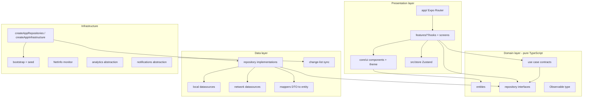
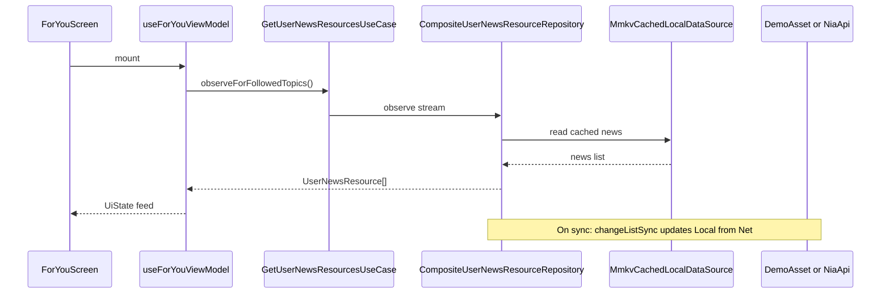

# Now in Android RN — Architecture, libraries & tech stack (CV reference)

**Purpose:** Detailed technical documentation for resumes, LinkedIn, portfolios, and interviews.  
**Repository:** https://github.com/michaelsam94/NowInAndroidRN  
**Reference app:** [Google Now in Android](https://github.com/android/nowinandroid) (Kotlin · Jetpack Compose · Room · Hilt)

**Shorter summary:** [CV_TECH_STACK.md](./CV_TECH_STACK.md)

---

## Table of contents

1. [Project overview](#1-project-overview)
2. [Architecture overview](#2-architecture-overview)
3. [Layer-by-layer breakdown](#3-layer-by-layer-breakdown)
4. [Feature modules](#4-feature-modules)
5. [Navigation & deep linking](#5-navigation--deep-linking)
6. [Data flow & offline-first sync](#6-data-flow--offline-first-sync)
7. [State management](#7-state-management)
8. [UI system](#8-ui-system)
9. [Complete technology inventory](#9-complete-technology-inventory)
10. [Testing strategy](#10-testing-strategy)
11. [CI/CD, releases & DevOps](#11-cicd-releases--devops)
12. [Build flavors & environment](#12-build-flavors--environment)
13. [Skills matrix for CV / ATS](#13-skills-matrix-for-cv--ats)
14. [Resume bullet examples](#14-resume-bullet-examples)
15. [Interview talking points](#15-interview-talking-points)

---

## 1. Project overview

### What it is

A **cross-platform mobile client** that recreates the **Now in Android (NIA)** sample app: a news reader with topic onboarding, personalized feed, bookmarks (with notes), search, interests, settings, and deep links. The project is a **deliberate port** from the official Android codebase to **React Native + Expo**, preserving **Clean Architecture**, **offline-first data**, and **test-driven development**.

### What you can claim on a CV

| Area | Summary |
|------|---------|
| **Role framing** | Mobile engineer · React Native · architecture · TDD · CI/CD |
| **Scope** | Full app: 6 feature areas, shared design system, data layer, sync, E2E |
| **Differentiator** | Ported from production-style Android app; not a tutorial todo list |
| **Delivery** | GitHub Actions, Gradle APK, GitHub Releases on tags, EAS cloud builds, Maestro E2E |

### High-level metrics (order of magnitude)

| Metric | Value |
|--------|--------|
| TypeScript source (`src/`) | ~180 files |
| Unit/integration tests | 68+ tests (Jest) |
| Maestro E2E flows | 6 flows + 3 subflows |
| Demo content | Bundled JSON (topics + news) |
| CI jobs | Lint, test, Android assemble, Maestro, EAS (main) |

---

## 2. Architecture overview

### Pattern: Clean Architecture + UDF (Unidirectional Data Flow)

The app separates **business rules** (domain) from **frameworks** (React Native, Expo) and **data sources** (MMKV, network, assets). Presentation uses **ViewModels implemented as React hooks** and immutable **`UiState`** objects—similar to Android’s UDF + ViewModel pattern in the original NIA app.



### Dependency rules (enforced in code review + ESLint)

| Layer | Allowed imports | Forbidden |
|-------|-----------------|-----------|
| `src/core/domain` | Other domain files only | React, Expo, `core/data`, `features` |
| `src/core/data` | `core/domain`, data internals | Feature screens/hooks |
| `src/core/ui` | `core/domain`, React, styling | Feature-specific logic |
| `src/features/*` | `@core/domain`, `@core/ui`, own module | Other features’ `hooks/`, `screens/` |
| `app/` | `@features/*/index`, `@core/ui` | Direct imports of feature hooks |

### Path aliases (module resolution)

| Alias | Resolves to | Config |
|-------|-------------|--------|
| `@core/*` | `src/core/*` | `tsconfig.json`, Babel `module-resolver` |
| `@features/*` | `src/features/*` | same |
| `@store/*` | `src/store/*` | same |

### Comparison to original Android app

| Android (NIA) | This project (RN) |
|---------------|-------------------|
| Kotlin + Jetpack Compose | TypeScript + React Native |
| Hilt DI | Manual composition root (`createAppRepositories`) |
| Room + FTS | MMKV cache + in-memory/JSON local store (WatermelonDB in test harness) |
| DataStore (Proto) | MMKV + `UserPreferencesDataSource` |
| Kotlin Flow | Custom `Observable<T>` + `useObservable` hook |
| WorkManager sync | `SyncManager` + cold-start bootstrap |
| Product flavors demo/prod | `EXPO_PUBLIC_FLAVOR` + EAS profiles |
| Instrumented tests | Maestro YAML E2E |

---

## 3. Layer-by-layer breakdown

### 3.1 Domain layer (`src/core/domain/`)

**Zero dependency on React Native.** Contains business types and contracts only.

#### Entities (`entities/`)

| Entity | Responsibility |
|--------|----------------|
| `NewsResource` | Article metadata (title, URL, publish date, topics, type) |
| `UserNewsResource` | News + user flags (saved, viewed, note) |
| `Topic` / `FollowableTopic` | Topic catalog + follow state |
| `UserData` | Bookmarks, followed topics, theme prefs, onboarding flag |
| `SearchResult` / `UserSearchResult` | Search hits + presentation fields |
| `RecentSearchQuery` | Recent search history |
| `BookmarkNote` | Normalized bookmark note (max 280 chars) |
| `ThemeBrand` / `DarkThemeConfig` | Theme enums |
| `emptyUserData` | Default user state |

#### Repository interfaces (`repositories/`)

| Interface | Responsibility |
|-----------|----------------|
| `TopicsRepository` | Topic catalog + sync |
| `NewsRepository` | News resources + sync |
| `UserDataRepository` | Bookmarks, follows, theme, onboarding, notes |
| `UserNewsResourceRepository` | Combined news + user data streams |
| `SearchContentsRepository` | Full-text style search over local index |
| `RecentSearchRepository` | Persist recent queries |
| `Syncable` | `syncWith(synchronizer)` contract |

#### Use cases (`usecases/`)

| Use case | Purpose |
|----------|---------|
| `GetFollowableTopicsUseCase` | Topics for onboarding/interests (sort by name) |
| `GetUserNewsResourcesUseCase` | Feed streams (all, followed, bookmarked) |
| `GetSearchContentsUseCase` | Search with min query length |
| `GetRecentSearchQueriesUseCase` | Recent searches list |

Implementations live in `usecases/implementations/` and are wired in `createAppUseCases.ts`.

#### Reactive primitive (`types/Observable.ts`)

Custom **subscribe-based observable** (like Kotlin `Flow` or Rx `Observable`):

- `replayObservable` — replay last value to new subscribers (StateFlow-like)
- `collectObservable` — bridge to React `useState` via `useObservable` hook
- `combineObservable`, `mapObservable`, `switchObservable` — composition utilities

#### Domain utilities

| Module | Purpose |
|--------|---------|
| `bookmarks/completeBookmark.ts` | Bookmark + optional note in one operation |
| `entities/UserNewsResource.ts` | Map news + user data to view models |

---

### 3.2 Data layer (`src/core/data/`)

Implements repository interfaces with **offline-first** behavior: read from local cache, sync from network when possible.

#### Local datasources (`datasources/local/`)

| Class | Purpose |
|-------|---------|
| `MmkvCachedLocalDataSource` | Persists topics/news in MMKV; survives process death |
| `InMemoryLocalDataSource` | In-memory fallback / tests |
| `LocalDataSource` | Interface for CRUD on topics/news |

#### Network datasources (`datasources/network/`)

| Class | Purpose |
|-------|---------|
| `DemoAssetDataSource` | Loads `assets/demo/topics.json` + `news.json` (demo flavor) |
| `NiaApiDataSource` | REST client when `EXPO_PUBLIC_API_BASE` is set (prod) |
| `changeList.ts` | DTO types for changelist sync API |

#### User preferences (`datasources/mmkv/`)

| Class | Purpose |
|-------|---------|
| `UserPreferencesDataSource` | UserData in MMKV (bookmarks, follows, theme, notes map) |

#### Repository implementations (`repositories/`)

| Class | Pattern |
|-------|---------|
| `OfflineFirstTopicsRepository` | Local-first + network sync |
| `OfflineFirstNewsRepository` | Local-first + network sync |
| `OfflineFirstUserDataRepository` | Delegates to preferences |
| `CompositeUserNewsResourceRepository` | Joins news + user streams reactively |
| `DefaultSearchContentsRepository` | Local search index |
| `DefaultRecentSearchRepository` | Recent query persistence |

#### Sync (`sync/`)

| Module | Purpose |
|--------|---------|
| `changeListSync.ts` | Generic changelist apply (delete/update + version bump) |
| `MmkvSynchronizer.ts` | Stores changelist version numbers in MMKV |
| `resetSyncVersions.ts` | Reset versions when cache empty (fix stale sync) |
| `seedDatabase.ts` | First-launch seed + default followed topics (1, 2, 3) |

#### Models (`models/`)

| Module | Purpose |
|--------|---------|
| `mappers.ts` | DTO → domain entity (dedupe topic IDs on articles) |
| `network.ts` | Network DTO shapes |

---

### 3.3 Infrastructure layer (`src/core/infrastructure/`)

**Composition root** — wires concrete implementations (similar to a Hilt/Dagger module).

| Module | Responsibility |
|--------|----------------|
| `data/createAppRepositories.ts` | Singleton repos, MMKV, network source selection (demo vs API) |
| `createAppInfrastructure.ts` | Analytics, sync manager, NetInfo, notifier, browser/share |
| `sync/createAppSyncManager.ts` | Orchestrates topic/news sync; empty-cache full sync |
| `bootstrap/useInfrastructureBootstrap.ts` | Runs sync when app ready + network available |
| `network/createNetInfoNetworkMonitor.ts` | Drives offline snackbar + Zustand `isOffline` |
| `analytics/*` | `AnalyticsHelper` interface; stub/no-op for demo |
| `notifications/*` | `Notifier` interface; permission request; deep link parsing |
| `features/defaultFeatureDeps.ts` | Default deps for feature ViewModels |
| `domain/createAppUseCases.ts` | Factory for use case instances |
| `query/queryClient.ts` | TanStack Query client (global) |

**Bootstrap sequence** (`AppProviders.tsx`):

1. `bootstrapAppData()` — seed if empty, sync topics/news  
2. Load counts, apply default followed topics if needed  
3. Hydrate theme into Zustand  
4. Set `isAppReady` → show navigation (E2E builds unlock UI earlier via `extra.e2e`)

---

### 3.4 UI layer (`src/core/ui/`)

Shared presentation building blocks.

| Area | Contents |
|------|----------|
| **Components** | `NewsResourceCard`, `BookmarkedNewsResourceCard`, `TopicChip`, `EmptyState`, `LoadingWheel`, bookmark dialogs, `OfflineSnackbar`, `NiaDraggableScrollbar` |
| **Theme** | `ThemeContext`, MD3-inspired `tokens`, light/dark |
| **Shell** | `NiaAppShell` — offline snackbar wrapper |
| **Hooks** | `useObservable` — domain Observable → React state |
| **Layout** | `useAdaptiveLayout` — navigation rail (≥600dp), two-pane thresholds |
| **Diagnostics** | `NiaErrorBoundary`, `[NIA]` logger |
| **Strings** | Centralized `uiStrings` (a11y labels, bookmark copy) |

**Styling:** NativeWind v4 (Tailwind className on RN components) + inline styles for dynamic theme colors.

---

### 3.5 Presentation routes (`app/`)

Expo Router **file-based routing**:

| Route | Screen |
|-------|--------|
| `app/_layout.tsx` | Root: providers, bootstrap gate, stack |
| `app/index.tsx` | Redirect loader → `/foryou` |
| `app/(tabs)/foryou.tsx` | For You tab |
| `app/(tabs)/bookmarks.tsx` | Saved tab |
| `app/(tabs)/interests.tsx` | Interests tab |
| `app/(tabs)/_layout.tsx` | Bottom tabs / side rail + header actions |
| `app/search.tsx` | Search (stack) |
| `app/topic/[id].tsx` | Topic detail |
| `app/settings.tsx` | Settings (modal) |
| `app/licenses.tsx` | OSS licenses |

---

## 4. Feature modules

Each feature under `src/features/<name>/`:

```
features/<name>/
  index.ts          # public exports only
  types.ts          # ViewModel + UiState contracts
  hooks/            # use*ViewModel.ts
  screens/          # pure UI + tests
```

| Feature | ViewModel hook | Key capabilities |
|---------|----------------|------------------|
| **For You** | `useForYouViewModel` | Onboarding, topic follow, feed, deep-link highlight, bookmark dialog, pull-to-sync state |
| **Bookmarks** | `useBookmarksViewModel` | Saved list, multi-select, bulk remove, undo, note editor |
| **Search** | `useSearchViewModel` | Query, results, recent searches, bookmark from search |
| **Interests** | `useInterestsViewModel` | Topic list + detail selection |
| **Topic** | `useTopicViewModel` | Single topic + related news |
| **Settings** | `useSettingsViewModel` | Theme brand, dark mode, dynamic color |

**Rule:** Screens only render `UiState` and call ViewModel callbacks — **no direct repository access** in JSX files.

---

## 5. Navigation & deep linking

| Mechanism | Detail |
|-----------|--------|
| **Expo Router v6** | File-based routes, typed routes experiment |
| **Tabs** | For You, Saved, Interests |
| **Stack** | Search, settings, licenses, topic |
| **Custom scheme** | `nowinandroid://` |
| **App Links** | `https://www.nowinandroid.apps.samples.google.com/foryou/...` |
| **Deep link state** | `deepLinkSlice` in Zustand; parser in `infrastructure/notifications/deepLink.ts` |

**Adaptive UI:**

- Width ≥ 600dp → navigation rail (tab bar on left)  
- Interests supports list–detail layout on large widths  

---

## 6. Data flow & offline-first sync

### Typical feed load



### Changelist sync (simplified)

1. Read local version from `MmkvSynchronizer`  
2. Fetch changelist since version from network  
3. Apply deletes and updates to local store  
4. Persist new version  

If local cache is **empty** but versions are stale, `resetSyncVersions` + full sync runs (fixes “empty feed after restart” class of bugs).

### Demo vs production data source

| Flavor | Network source | Package ID |
|--------|----------------|------------|
| **demo** | Bundled JSON assets | `com.nowinandroidrn.demo` |
| **prod** | `NiaApiDataSource` + `EXPO_PUBLIC_API_BASE` | `com.nowinandroidrn` |

Controlled in `createAppRepositories.ts` via `app.config.ts` / env.

---

## 7. State management

### Global: Zustand (`src/store/`)

| Slice | State | Persistence |
|-------|-------|-------------|
| `themeSlice` | `themeBrand`, `darkThemeConfig`, `useDynamicColor` | MMKV via `persist` middleware |
| `syncSlice` | `isSyncing` | Memory only |
| `networkSlice` | `isOffline` | Memory only |
| `navigationSlice` | Tab unread badges | Memory only |
| `deepLinkSlice` | `deepLinkedNewsId` | Memory only |

**Also:** User preferences duplicated in `UserDataRepository` for domain operations; Zustand holds **UI-global** flags.

### Feature-local: React `useState` in ViewModels

Example: bookmark **selection mode**, **pending bookmark dialog**, **undo payload** — kept in `useBookmarksViewModel`, not global store (better encapsulation).

### Server/async: TanStack Query v5

`QueryClientProvider` in `AppProviders` — used where async query patterns fit; domain streams remain primary for feeds.

---

## 8. UI system

| Aspect | Implementation |
|--------|----------------|
| **Design language** | Material Design 3–inspired colors (`tokens.ts`) |
| **Styling** | NativeWind v4 + Tailwind 3.4 |
| **Lists** | Shopify FlashList (performant scrolling) |
| **Icons** | `@expo/vector-icons` (Ionicons, MaterialCommunityIcons) |
| **Motion** | Reanimated 4 + Gesture Handler |
| **Accessibility** | `accessibilityRole`, `accessibilityLabel`, `testID` for Maestro |
| **Edge-to-edge** | Enabled in Expo Android config |

### Shared components (hire-worthy detail)

- **NewsResourceCard** — bookmark toggle, topic chips, viewed state  
- **BookmarkedNewsResourceCard** — selection mode, note indicator, long-press to select  
- **BookmarkNoteDialog** / **BookmarkNoteEditorDialog** — note CRUD with validation  
- **OfflineSnackbar** — NetInfo-driven  
- **EmptyState** / **LoadingWheel** — consistent empty/loading UX  

---

## 9. Complete technology inventory

### 9.1 Runtime & framework

| Technology | Version | Role |
|------------|---------|------|
| **Node.js** | ≥ 22.11 | Tooling, CI |
| **npm** | lockfile | Package manager |
| **React** | 19.1.0 | UI runtime |
| **React Native** | 0.81.5 | Mobile framework |
| **Expo SDK** | ~54.0.33 | Managed workflow, modules, prebuild |
| **Expo Router** | ~6.0.23 | Navigation, entry via `expo-router/entry` |
| **React New Architecture** | Enabled | Fabric/TurboModules path |
| **Hermes** | (bundled) | JS engine on Android |

### 9.2 Production dependencies

| Package | Version | Category |
|---------|---------|----------|
| `expo` | ~54.0.33 | Platform |
| `expo-router` | ~6.0.23 | Navigation |
| `expo-constants` | ~18.0.13 | Config / env |
| `expo-font` | ~14.0.11 | Typography |
| `expo-linking` | ~8.0.11 | Deep links |
| `expo-notifications` | ~0.32.17 | Push (scaffold) |
| `expo-splash-screen` | ~31.0.13 | Splash |
| `expo-status-bar` | ~3.0.9 | Status bar |
| `expo-system-ui` | ~6.0.9 | System UI |
| `expo-web-browser` | ~15.0.10 | Open articles |
| `@react-navigation/native` | ^7.1.8 | Nav core (Expo dependency) |
| `@react-native-community/netinfo` | 11.4.1 | Connectivity |
| `@shopify/flash-list` | 2.0.2 | Lists |
| `@tanstack/react-query` | ^5.80.7 | Async state |
| `zustand` | ^5.0.5 | Global store |
| `react-native-mmkv` | ^3.3.0 | Fast storage |
| `react-native-reanimated` | ~4.1.1 | Animation |
| `react-native-gesture-handler` | ~2.28.0 | Gestures |
| `react-native-safe-area-context` | ~5.6.0 | Safe areas |
| `react-native-screens` | ~4.16.0 | Native screens |
| `react-native-worklets` | 0.5.1 | Reanimated worklets |
| `nativewind` | ^4.1.23 | Utility CSS for RN |
| `@expo/vector-icons` | ^15.0.3 | Icons |

### 9.3 Dev dependencies

| Package | Version | Category |
|---------|---------|----------|
| `typescript` | ~5.9.2 | Type system (strict) |
| `jest` | ^29.6.3 | Test runner |
| `jest-expo` | ~54.0.13 | Expo Jest preset |
| `@testing-library/react-native` | ^13.3.3 | Component tests |
| `@testing-library/jest-native` | ^5.4.3 | Matchers |
| `react-test-renderer` | 19.1.0 | Render |
| `msw` | ^2.7.3 | API mocking |
| `@nozbe/watermelondb` | ^0.28.0 | Test DB (Loki adapter) |
| `lokijs` | ^1.5.12 | In-memory DB for tests |
| `eslint` | ^8.19.0 | Lint |
| `@react-native/eslint-config` | 0.81.5 | RN lint rules |
| `prettier` | 2.8.8 | Format |
| `babel-preset-expo` | ~54.0.0 | Transpile |
| `babel-plugin-module-resolver` | ^5.0.2 | Path aliases |
| `tailwindcss` | ^3.4.17 | Tailwind compiler |
| `@babel/core` | ^7.25.2 | Babel |
| `@react-native/metro-config` | 0.81.5 | Bundler config |
| `@react-native/typescript-config` | 0.81.5 | TS base |

### 9.4 Native & build tooling

| Tool | Role |
|------|------|
| **Gradle** | 9.3.x — Android builds |
| **Kotlin** | 2.x — Android native code |
| **Android SDK** | API 34 emulator in CI |
| **CocoaPods** | iOS native deps (prebuild) |
| **EAS CLI** | Cloud builds (`eas.json`) |
| **Metro** | JS bundler |
| **expo prebuild** | Generate `android/` / `ios/` |

### 9.5 External services & CI tools

| Service / tool | Role |
|----------------|------|
| **GitHub Actions** | CI/CD |
| **softprops/action-gh-release** | Attach APK to releases |
| **ReactiveCircus/android-emulator-runner** | Emulator + Maestro |
| **Expo Application Services (EAS)** | Hosted builds |
| **Maestro** | Mobile E2E |
| **GitHub Releases** | Tag-based APK distribution |

---

## 10. Testing strategy

### Philosophy: TDD (phased delivery)

Red → Green → Refactor across 11 documented phases (`docs/CONVERSION_PLAN.md`). Tests colocated in `__tests__/` folders.

### Unit & integration (Jest + RNTL)

| Area | Examples |
|------|----------|
| **Domain** | `BookmarkNote`, `UserSearchResult`, use case behavior |
| **Data** | Mappers, repositories, sync, seed, MMKV preferences |
| **UI** | Cards, dialogs, chips, empty states |
| **Features** | ViewModels, screens (bookmarks selection bar) |
| **Infrastructure** | Sync manager, analytics factory, deep link parser |

**Tooling:**

- `test/setup.ts` — MSW, mocks (NetInfo, MMKV, expo-linking, notifications)  
- `test/fakes/` — `TestUserDataRepository`, `TestUserNewsResourceRepository`  
- `test/msw/` — API handlers for tests  
- `test/watermelon/` — DB test harness  

**CI:** `npm run test:ci` — coverage report, 2 workers.

### End-to-end (Maestro)

| Flow | Scenario |
|------|----------|
| `onboarding-feed.yaml` | Fresh install → onboarding → feed |
| `bookmark-note.yaml` | Bookmark + note → Saved tab |
| `bulk-undo.yaml` | Multi-select remove + undo |
| `edit-delete-note.yaml` | Edit/delete note |
| `search-bookmark.yaml` | Search → bookmark |
| `deeplink-highlight.yaml` | HTTPS deep link → article |

**CI:** Ubuntu + KVM + `assembleDebug` + install + `maestro test e2e/flows`.

---

## 11. CI/CD, releases & DevOps

### Workflows (`.github/workflows/`)

| Workflow | Trigger | Jobs |
|----------|---------|------|
| **ci.yml** | Push/PR to `main` | `lint-and-test`, `android-demo-assemble`, `e2e-maestro`, `eas-demo-build` (main only) |
| **release.yml** | Push tag `v*` | Lint, typecheck, `assembleRelease`, GitHub Release + APK asset |

### CI pipeline detail

1. **lint-and-test** — ESLint, `tsc --noEmit`, Jest with coverage  
2. **android-demo-assemble** — `expo prebuild` (demo), Gradle `assembleDebug`  
3. **e2e-maestro** — KVM emulator, Maestro flows  
4. **eas-demo-build** — `eas build --profile demo` (needs `EXPO_TOKEN`, `EAS_PROJECT_ID`)

### Release pipeline (tags)

```bash
git tag v0.0.1
git push origin v0.0.1
```

Produces: **`NowInAndroidRN-demo-v0.0.1.apk`** on GitHub Releases (demo package, release bundle via `expo-router/entry`).

### Scripts

| Script | Purpose |
|--------|---------|
| `.github/scripts/run-maestro-e2e.sh` | Build, install, run Maestro |
| `.github/scripts/build-android-apk.sh` | Prebuild + Gradle APK (debug/release) |

---

## 12. Build flavors & environment

### Environment variables

| Variable | Purpose |
|----------|---------|
| `EXPO_PUBLIC_FLAVOR` | `demo` \| `prod` |
| `EXPO_PUBLIC_API_BASE` | REST API base URL (prod) |
| `EXPO_PUBLIC_E2E` | `1` = unlock UI during bootstrap (Maestro CI) |
| `EAS_PROJECT_ID` | Expo project UUID (CI secret) |
| `EXPO_TOKEN` | EAS auth (CI secret) |
| `EXPO_OWNER` | Expo account slug in `app.config.ts` |

### Config files

| File | Role |
|------|------|
| `app.config.ts` | Dynamic Expo config (name, package, plugins, extra) |
| `eas.json` | EAS build profiles: development, demo, prod |
| `e2e/config.yaml` | Maestro appId `com.nowinandroidrn.demo` |
| `babel.config.js` | Aliases, NativeWind, Reanimated plugin |
| `tsconfig.json` | Strict TypeScript |
| `.eslintrc.js` | Layer boundary rules |
| `tailwind.config.js` | NIA color tokens |
| `index.js` | Metro entry shim → `expo-router/entry` |

### NPM scripts (developer & CI)

| Script | Command |
|--------|---------|
| Start dev server | `npm start` |
| Run Android | `npm run android` |
| Run iOS | `npm run ios` |
| Lint | `npm run lint` |
| Typecheck | `npm run typecheck` |
| Unit tests | `npm run test` / `npm run test:ci` |
| E2E | `npm run e2e` |
| Prebuild demo/prod | `npm run prebuild:demo` / `prebuild:prod` |
| EAS build | `npm run build:demo` / `build:prod` |

---

## 13. Skills matrix for CV / ATS

Use as keywords or “Skills” section groupings.

### Mobile development

React Native, Expo, Expo Router, cross-platform mobile development, Android development, iOS development, mobile UI, adaptive layout, responsive design, Hermes, native modules, expo prebuild, deep linking, App Links, push notifications (Expo Notifications), offline-first mobile apps

### Languages

TypeScript, JavaScript, Kotlin, YAML, Bash, JSON, strict typing

### Architecture & patterns

Clean Architecture, layered architecture, domain-driven design, MVVM, unidirectional data flow (UDF), repository pattern, use case / interactor pattern, dependency injection, composition root, feature modules, separation of concerns, reactive programming, Observer pattern, offline-first, changelist sync, API versioning

### State & data

Zustand, TanStack Query, React Query, MMKV, key-value storage, local-first, data synchronization, REST API, JSON, data mapping, DTO mapping, caching strategies

### UI / UX

NativeWind, Tailwind CSS, Material Design 3, FlashList, React Native Reanimated, Gesture Handler, Safe Area Context, accessibility, a11y, design tokens, component library, Ionicons

### Testing

Jest, React Native Testing Library, TDD, test-driven development, unit testing, integration testing, E2E testing, Maestro, MSW, Mock Service Worker, test doubles, fakes, code coverage, colocated tests

### DevOps & tooling

GitHub Actions, CI/CD, continuous integration, Gradle, Android Gradle Plugin, EAS Build, Expo Application Services, GitHub Releases, semantic versioning, KVM, Android emulator, ESLint, Prettier, TypeScript compiler, Metro bundler, Babel, npm

### Practices

Git, technical documentation, porting legacy apps, Google Now in Android, code review, lint rules, monorepo-style modules, environment-based configuration, build flavors

---

## 14. Resume bullet examples

### Short (1 line each)

- Ported **Now in Android** to **React Native (Expo)** with **TypeScript**, **Clean Architecture**, and **68+ Jest tests**.
- Built **offline-first** sync with **MMKV**, changelist versioning, and **demo/prod** flavors.
- Delivered **Maestro E2E** and **GitHub Actions** (lint, coverage, Gradle APK, emulator CI, tag releases).

### Medium (2 lines each)

- Architected and implemented a **React Native** client mirroring Google’s **Now in Android**, using **Clean Architecture** (domain/data/UI/infrastructure), **repository + use case** patterns, and a custom **Observable** layer analogous to Kotlin **Flow**.
- Owned **data layer**: **MMKV** persistence, **offline-first** repositories, **changelist sync**, bundled demo assets, and configurable **REST** backend for production flavor.

- Built **6 feature modules** (For You, Bookmarks, Search, Interests, Settings, Topic) with **UDF ViewModels** (hooks), **NativeWind** UI, **FlashList**, and **Material Design 3** theming with dark mode.
- Established **CI/CD**: **GitHub Actions** (ESLint, TypeScript, Jest coverage, **Gradle** APK, **KVM** emulator + **Maestro**), **EAS Build**, and **GitHub Releases** on `v*` tags.

### Long (project block header)

**Now in Android — React Native** | *Personal / Open Source* | GitHub: github.com/michaelsam94/NowInAndroidRN  

Cross-platform port of Google’s Now in Android sample. **Expo SDK 54**, **TypeScript**, **Clean Architecture**, **Zustand**, **MMKV**, **TanStack Query**, **NativeWind**, **FlashList**. Offline-first feed and bookmarks with changelist sync; Maestro E2E; GitHub Actions + EAS + release APK automation.

---

## 15. Interview talking points

1. **Why Clean Architecture on RN?**  
   Keeps domain testable without a device; mirrors the Kotlin app so features map 1:1; ESLint enforces boundaries.

2. **How does sync work?**  
   Versioned changelist; local MMKV cache; full sync when empty; demo uses bundled JSON instead of Retrofit.

3. **How do ViewModels work without AndroidX?**  
   Custom hooks hold `UiState`; `useObservable` subscribes to domain streams; screens are dumb components.

4. **Biggest porting challenges?**  
   Flow → Observable; Room → MMKV + local datasource; Hilt → manual composition root; Compose navigation → Expo Router.

5. **Testing pyramid?**  
   Many Jest/RNTL tests for domain/data/UI; Maestro for critical user journeys; MSW/fakes for isolation.

6. **CI reliability lessons?**  
   Emulator on Ubuntu+KVM; Maestro needs testIDs not header text; E2E flag to avoid bootstrap deadlock; Gradle entry `expo-router/entry`.

---

## 16. Related documentation in repo

| Document | Content |
|----------|---------|
| [CONVERSION_PLAN.md](./CONVERSION_PLAN.md) | Full 11-phase migration plan |
| [phase-1-audit.md](./phase-1-audit.md) | Feature audit vs Android |
| [phase-2-architecture.md](./phase-2-architecture.md) | Layers & dependency rules |
| [phase-3-testing.md](./phase-3-testing.md) | Jest/MSW harness |
| [phase-10-e2e.md](./phase-10-e2e.md) | Maestro flows |
| [phase-11-cicd.md](./phase-11-cicd.md) | CI/CD overview |
| [RELEASE_CHECKLIST.md](./RELEASE_CHECKLIST.md) | Release & tag instructions |
| [CV_TECH_STACK.md](./CV_TECH_STACK.md) | Condensed stack list |

---

*Document generated for CV/portfolio use. Align version numbers with `package.json` when updating.*
