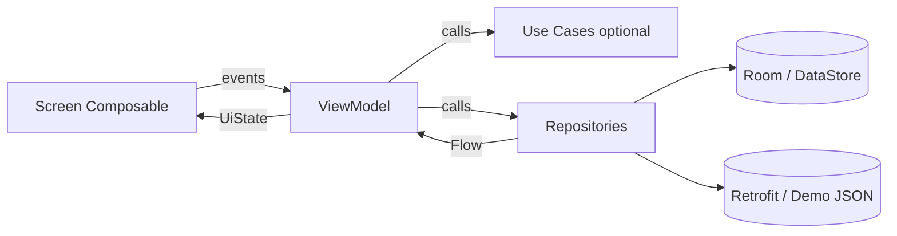

# Phase 1 — Feature Audit & Mapping

**Date:** 2026-05-18  
**Reference repo:** `llm-android-test-michaelsam94` (Now in Android fork with bookmark notes + multi-select)  
**Target repo:** `NowInAndroid RN`  
**Status:** Complete — ready for Phase 2 review

---

## 1. Executive summary

The reference app is a modular Kotlin + Jetpack Compose news reader with **Navigation 3** (`NavKey` + `NavDisplay`), **Hilt DI**, **Room + FTS5**, **Proto DataStore**, **WorkManager sync**, and **demo/prod** product flavors. This fork adds **bookmark notes (280 chars)**, **multi-select bulk remove with undo**, and **note editor** on the Saved tab.

The React Native target will preserve feature parity using **Expo Router**, **Zustand**, **TanStack Query**, **WatermelonDB**, **MMKV**, and **expo-*** modules for native capabilities (see gap matrix §8).

---

## 2. Reference module structure

From `settings.gradle.kts`:

| Layer | Gradle modules |
|-------|----------------|
| App shell | `:app` |
| Features (api + impl) | `:feature:foryou`, `:feature:bookmarks`, `:feature:interests`, `:feature:topic`, `:feature:search` (+ api/impl); `:feature:settings:impl` only |
| Core | `:core:model`, `:core:domain`, `:core:data`, `:core:database`, `:core:datastore`, `:core:datastore-proto`, `:core:network`, `:core:navigation`, `:core:ui`, `:core:designsystem`, `:core:common`, `:core:analytics`, `:core:notifications` |
| Sync | `:sync:work` |
| Test support | `:core:testing`, `:core:data-test`, `:core:datastore-test`, `:core:screenshot-testing`, `:sync:sync-test`, `:ui-test-hilt-manifest` |

**RN mapping:** `src/core/*` + `src/features/<name>/*` + `app/*` (Expo Router only).

---

## 3. Navigation & screens

### 3.1 Destinations

| UI | Type | Android `NavKey` / entry | Screen composable | Entry provider |
|----|------|--------------------------|-------------------|----------------|
| For You | Top tab | `ForYouNavKey` (object) | `feature/foryou/impl/.../ForYouScreen.kt` | `ForYouEntryProvider.kt` |
| Saved | Top tab | `BookmarksNavKey` (object) | `feature/bookmarks/impl/.../BookmarksScreen.kt` | `BookmarksEntryProvider.kt` |
| Interests | Top tab | `InterestsNavKey(initialTopicId?)` | `feature/interests/impl/.../InterestsScreen.kt` | `InterestsEntryProvider.kt` |
| Search | Stack (from app bar) | `SearchNavKey` (object) | `feature/search/impl/.../SearchScreen.kt` | `SearchEntryProvider.kt` |
| Topic detail | Stack | `TopicNavKey(id: String)` | `feature/topic/impl/.../TopicScreen.kt` | `TopicEntryProvider.kt` |
| Settings | Modal (not NavKey) | — | `feature/settings/impl/.../SettingsDialog.kt` | Invoked from `NiaApp.kt` |

**Wiring:** `app/src/main/kotlin/.../ui/NiaApp.kt` (lines ~259–265: `entryProvider` + `forYouEntry`, `bookmarksEntry`, etc.)  
**Tab definitions:** `app/.../navigation/TopLevelNavItem.kt` → `TOP_LEVEL_NAV_ITEMS`

### 3.2 Planned Expo Router map

| Route | File (planned) | Params |
|-------|----------------|--------|
| For You tab | `app/(tabs)/foryou.tsx` | `linkedNewsResourceId?` (deep link) |
| Saved tab | `app/(tabs)/bookmarks.tsx` | — |
| Interests tab | `app/(tabs)/interests.tsx` | `initialTopicId?` |
| Search | `app/search.tsx` | — |
| Topic | `app/topic/[id].tsx` | `id` |
| Settings | `app/settings.tsx` or modal | — |
| Root layout | `app/(tabs)/_layout.tsx` | Adaptive: bottom tabs vs rail |

### 3.3 Shell & app state

| Concern | Android | RN (planned) |
|---------|---------|--------------|
| Offline snackbar | `NiaApp.kt` + `NiaAppState.isOffline` | Root layout + NetInfo + `OfflineSnackbar` |
| Unread tab dots | `NiaAppState` + `NavigationState` | Zustand selector + tab icon badge |
| Splash gate | `MainActivity` + `MainActivityViewModel` | `expo-splash-screen` until prefs + sync/query ready |
| Gradient background | For You only in `NiaApp` | Theme conditional in tab layout |
| List–detail adaptive | `rememberListDetailSceneStrategy()` (≥600dp class sizes) | `useWindowDimensions`: ≥600 rail, ≥840 two-pane |

**Files:** `app/.../NiaAppState.kt`, `app/.../MainActivityViewModel.kt`, `app/.../MainActivity.kt`

---

## 4. Unidirectional data flow (per feature)

| Feature | ViewModel | Key UiState concerns | Repositories / use cases |
|---------|-----------|----------------------|---------------------------|
| For You | `ForYouViewModel.kt` | feed, onboarding, sync overlay, deep link id, permission | `UserNewsResourceRepository`, `TopicsRepository`, `UserDataRepository`; topic follow |
| Bookmarks | `BookmarksViewModel.kt` | saved list, selection mode, undo, note editor | `UserNewsResourceRepository`, `UserDataRepository`, `BookmarkNoteActions` |
| Interests | `InterestsViewModel.kt` | topics list, selected topic id (list-detail) | `GetFollowableTopicsUseCase`, `TopicsRepository`, `UserDataRepository` |
| Search | `SearchViewModel.kt` | query, results, recent, loading | `GetSearchContentsUseCase`, `GetRecentSearchQueriesUseCase`, `RecentSearchRepository` |
| Topic | `TopicViewModel.kt` | topic, news list, follow | `TopicsRepository`, `NewsRepository`, `UserDataRepository` |
| Settings | `SettingsViewModel.kt` | brand, dark mode, dynamic color | `UserDataRepository` |

**RN:** Each feature gets `hooks/use<Feature>ViewModel.ts` + Zustand slice where local UI state (e.g. selection) is needed.

---

## 5. Domain model & repositories

### 5.1 Entities (`:core:model`)

| Entity | File | RN type (planned) |
|--------|------|-------------------|
| `NewsResource` | `core/model/.../NewsResource.kt` | `NewsResource` |
| `UserNewsResource` | `UserNewsResource.kt` | `UserNewsResource` |
| `Topic`, `FollowableTopic` | `Topic.kt`, `FollowableTopic.kt` | `Topic`, `FollowableTopic` |
| `UserData` | `UserData.kt` | `UserData` |
| `BookmarkNote` + `normalizeBookmarkNote` | `BookmarkNote.kt` | `normalizeBookmarkNote()` in domain |
| `SearchResult`, `UserSearchResult` | `SearchResult.kt`, `UserSearchResult.kt` | Search DTOs |
| `ThemeBrand`, `DarkThemeConfig` | `ThemeBrand.kt`, `DarkThemeConfig.kt` | Theme enums |

### 5.2 Repository interfaces (`:core:data/repository`)

| Interface | Implementation | RN path (planned) |
|-----------|----------------|-------------------|
| `UserDataRepository` | `OfflineFirstUserDataRepository.kt` | `core/data/repositories/UserDataRepository.ts` |
| `NewsRepository` | `OfflineFirstNewsRepository.kt` | `NewsRepository.ts` |
| `TopicsRepository` | `OfflineFirstTopicsRepository.kt` | `TopicsRepository.ts` |
| `UserNewsResourceRepository` | `CompositeUserNewsResourceRepository.kt` | `UserNewsResourceRepository.ts` |
| `SearchContentsRepository` | `DefaultSearchContentsRepository.kt` | `SearchContentsRepository.ts` |
| `RecentSearchRepository` | `DefaultRecentSearchRepository.kt` | `RecentSearchRepository.ts` |
| `BookmarkNoteActions` | (extension on user data) | Part of `UserDataRepository` |

### 5.3 Use cases (`:core:domain`)

| Use case | File |
|----------|------|
| `GetFollowableTopicsUseCase` | `core/domain/.../GetFollowableTopicsUseCase.kt` |
| `GetSearchContentsUseCase` | `GetSearchContentsUseCase.kt` |
| `GetRecentSearchQueriesUseCase` | `GetRecentSearchQueriesUseCase.kt` |

---

## 6. Data layer mapping

### 6.1 Room → WatermelonDB

**Database:** `core/database/.../NiaDatabase.kt` (v14, auto-migrations)

| Room entity | DAO | WatermelonDB model (planned) |
|-------------|-----|------------------------------|
| `NewsResourceEntity` | `NewsResourceDao` | `news_resources` |
| `NewsResourceTopicCrossRef` | (via DAO joins) | `news_resource_topics` |
| `NewsResourceFtsEntity` | `NewsResourceFtsDao` | FTS virtual table / `@fulltext` |
| `TopicEntity` | `TopicDao` | `topics` |
| `TopicFtsEntity` | `TopicFtsDao` | topic FTS |
| `RecentSearchQueryEntity` | `RecentSearchQueryDao` | `recent_searches` |
| `PopulatedNewsResource` | (relation POJO) | Query helper / associations |

**Sync population:** `SyncWorker` → `SearchContentsRepository.populateFtsData()` after news/topics sync.

### 6.2 Proto DataStore → MMKV

**Proto:** `core/datastore-proto/.../user_preferences.proto`

| Field | Type | MMKV key / structure (planned) |
|-------|------|----------------------------------|
| `followed_topic_ids` | map | `Set<string>` or JSON array |
| `bookmarked_news_resource_ids` | map | `Set<string>` |
| `viewed_news_resource_ids` | map | `Set<string>` |
| `bookmark_notes` | map<string,string> | JSON object `{ [id]: note }` |
| `theme_brand` | enum | string enum |
| `dark_theme_config` | enum | string enum |
| `should_hide_onboarding` | bool | boolean |
| `use_dynamic_color` | bool | boolean |
| Change list versions | int32 | numbers for incremental sync |

**Access:** `core/datastore/.../NiaPreferencesDataSource.kt`  
**Migrations:** `IntToStringIdsMigration.kt`, `ListToMapMigration.kt` → one-time MMKV migration flags in RN.

### 6.3 Network

| Endpoint | Retrofit (`RetrofitNiaNetwork.kt`) | Demo |
|----------|-----------------------------------|------|
| `GET topics` | prod | `DemoNiaNetworkDataSource` + assets |
| `GET newsresources` | prod | bundled JSON |
| `GET changelists/topics` | prod | — |
| `GET changelists/newsresources` | prod | — |

**Flavor DI:** `core/network/src/demo|prod/.../FlavoredNetworkModule.kt`

**RN:** `NiaApiDataSource` (fetch) + `DemoAssetDataSource` (`EXPO_PUBLIC_FLAVOR=demo`).

---

## 7. Sync, notifications, deep links

### 7.1 Background sync

| Piece | Path |
|-------|------|
| Startup registration | `sync/work/.../initializers/SyncInitializer.kt` |
| Worker | `sync/work/.../workers/SyncWorker.kt` |
| Status | `sync/work/.../status/WorkManagerSyncManager.kt` |
| Prod FCM subscriber | `sync/work/src/prod/.../FirebaseSyncSubscriber.kt` |
| Demo stub | `sync/work/src/demo/.../SyncModule.kt` |

**RN:** `expo-background-fetch` task; `isSyncing` in Zustand; demo = NoOp + seed JSON on first launch.

### 7.2 Notifications

| Piece | Path |
|-------|------|
| `Notifier` interface | `core/notifications/.../Notifier.kt` |
| Prod | `SystemTrayNotifier.kt` |
| Demo | `NoOpNotifier` in `src/demo/.../NotificationsModule.kt` |
| Deep link URI | `https://www.nowinandroid.apps.samples.google.com/foryou/{linkedNewsResourceId}` |
| Extra key | `DEEP_LINK_NEWS_RESOURCE_ID_KEY` |

**Manifest:** `app/src/main/AndroidManifest.xml` — `https` host `www.nowinandroid.apps.samples.google.com`

**RN:** `expo-notifications`; pending deep link → Expo Router `/(tabs)/foryou?linkedNewsResourceId=`.

### 7.3 For You deep link UI

| Piece | Path |
|-------|------|
| VM state | `ForYouViewModel.kt` — consumes intent extra |
| UI effect | `ForYouScreen.kt` — `DeepLinkEffect` (scroll/highlight) |

**RN:** `useEffect` on route param + FlashList `scrollToIndex` + temporary highlight style.

### 7.4 Connectivity

| Piece | Path |
|-------|------|
| Monitor | `core/data/util/NetworkMonitor.kt`, `ConnectivityManagerNetworkMonitor.kt` |
| UI | `NiaApp.kt` — indefinite snackbar when offline |

**RN:** `@react-native-community/netinfo` → root snackbar.

### 7.5 In-app browser & share

| Android | RN |
|---------|-----|
| Chrome Custom Tab on card tap | `expo-web-browser` `openBrowserAsync`; mark viewed via `UserDataRepository` |
| Drag/long-press share on title | `Share.share({ message: title + '\n' + url })` — long-press only (no drag preview) |

---

## 8. Native API gap matrix

| # | Feature | Android API | RN approach | Parity | Trade-off |
|---|---------|-------------|-------------|--------|-----------|
| 1 | Staggered grid | Compose lazy staggered grid | FlashList masonry / `numColumns` | High | Column width ~300 logical px tuning |
| 2 | List–detail | Material3 adaptive `ListDetailPaneScaffold` | Custom split view by width | Medium | Manual breakpoint logic |
| 3 | Dynamic color | Material You monet | `react-native-material-you` or Android-only | Medium | Hidden on iOS |
| 4 | WorkManager | Guaranteed background work | `expo-background-fetch` | Medium | iOS scheduling limits |
| 5 | FCM | Firebase Cloud Messaging | `expo-notifications` + EAS | High (prod) | Requires Firebase config |
| 6 | Proto DataStore | Type-safe prefs | MMKV + manual schema | High | Migration scripts needed |
| 7 | Room FTS | SQLite FTS5 | WatermelonDB FTS / raw SQL | Medium | Verify query semantics in Phase 5 spike |
| 8 | Drag-to-share | Compose drag gesture | Long-press + Share API | Low–Medium | No live drag preview |
| 9 | Draggable scrollbar | Custom scrollbar | Simplified `ScrollView` indicator or FlashList scrollbar | Medium | Visual polish may differ |
| 10 | Splash API | Android 12 SplashScreen | `expo-splash-screen` | High | — |
| 11 | POST_NOTIFICATIONS | Runtime permission API 33+ | `expo-notifications` `requestPermissionsAsync` | High | — |
| 12 | OSS licenses | Play Services OSS licenses / custom | `license-checker` + scroll screen | High | Generate at build time |
| 13 | Hilt DI | Compile-time DI | Manual factories / context | N/A (pattern change) | Testability via fakes unchanged |
| 14 | Navigation 3 | `NavKey` serializable stack | Expo Router segments | High | Different API, same UX |
| 15 | Jank stats | `JankStats` | Optional Flipper / perf monitor | Low | Omit unless required |

---

## 9. Shared UI components (Android → RN)

| Component | Android path | Planned RN path |
|-----------|--------------|-----------------|
| `NewsResourceCard` | `core/ui/.../NewsResourceCard.kt` | `src/core/ui/components/NewsResourceCard.tsx` |
| `NewsResourceCardList` / feed | `NewsResourceCardList.kt`, `NewsFeed.kt` | Feature lists use FlashList |
| `BookmarkNoteDialog` | `core/ui/.../BookmarkNoteDialog.kt` | `BookmarkNoteDialog.tsx` |
| Bookmark note editor | Bookmarks feature composables | `BookmarkNoteEditorDialog.tsx` |
| `TopicChip` | `core/designsystem` | `TopicChip.tsx` |
| Loading wheel | `core/designsystem` | `LoadingWheel.tsx` |
| Empty states | Per-screen + designsystem | `EmptyState.tsx` |
| Top app bar / nav suite | `core/designsystem/.../NiaTopAppBar`, `NiaNavigationSuiteScaffold` | Tab layout + header component |
| Interests row | `core/ui/.../InterestsItem.kt` | `InterestsListItem.tsx` |

---

## 10. Feature requirements traceability (1–21)

| # | Requirement | Primary Android sources |
|---|-------------|-------------------------|
| 1 | For You feed | `ForYouScreen.kt`, `ForYouViewModel.kt`, `NewsFeed.kt` |
| 2 | Bookmarks / Saved | `BookmarksScreen.kt`, `BookmarksViewModel.kt`, `BookmarkSelectionLogicTest.kt` |
| 3 | Interests | `InterestsScreen.kt`, `InterestsViewModel.kt`, `InterestsListDetailScreenTest.kt` |
| 4 | Search | `SearchScreen.kt`, `SearchViewModel.kt`, `GetSearchContentsUseCase.kt` |
| 5 | Topic detail | `TopicScreen.kt`, `TopicViewModel.kt` |
| 6 | Settings | `SettingsDialog.kt`, `SettingsViewModel.kt` |
| 7 | Navigation shell | `NiaApp.kt`, `NiaAppState.kt`, `TopLevelNavItem.kt` |
| 8 | Shared news card | `NewsResourceCard.kt` |
| 9 | BookmarkNoteDialog | `BookmarkNoteDialog.kt`, `BookmarkNote.kt`, `BookmarkNoteTest.kt` |
| 10 | Offline snackbar | `NiaApp.kt`, `ConnectivityManagerNetworkMonitor.kt` |
| 11 | Background sync | `SyncWorker.kt`, `SyncInitializer.kt`, `WorkManagerSyncManager.kt` |
| 12 | Theming | `core/designsystem/theme/*`, `ThemeBrand.kt`, `UserData` prefs |
| 13 | Analytics | `core/analytics/*`, `AnalyticsExtensions.kt` |
| 14 | Adaptive layout | `NiaApp.kt`, `InterestsScreen.kt`, window size classes |
| 15 | Push notifications | `SystemTrayNotifier.kt`, `Notifier.kt`, prod flavor modules |
| 16 | Deep linking | `AndroidManifest.xml`, `SystemTrayNotifier.kt`, `DeepLinkEffect` |
| 17 | In-app browser | Custom tabs usage in card click handlers (via `core/ui` / feature screens) |
| 18 | Share sheet | Bookmarks / card title long-press handlers |
| 19 | Notification permission | `ForYouScreen.kt` / ViewModel (API 33+) |
| 20 | Network monitoring | `NetworkMonitor.kt`, `NiaAppState` |
| 21 | OSS licenses | Settings links + licenses screen in settings feature |

---

## 11. Fork-specific behaviors (must not drop)

From reference `README.md` and `BookmarksViewModel.kt`:

| Behavior | Rule | Test reference |
|----------|------|----------------|
| Bookmark note max length | 280 chars; `normalizeBookmarkNote` trims, blank → null | `BookmarkNoteTest.kt` |
| Note visibility | Only on Saved tab | Bookmarks UI only |
| Unbookmark | Deletes note synchronously | `BookmarksViewModelTest.kt` |
| Undo | Restores bookmark IDs **and** notes atomically | `BookmarksViewModelTest.kt` |
| Multi-select | Long-press enters mode; tap toggles; blur/ON_STOP clears | `BookmarkSelectionLogicTest.kt` |
| Bulk remove | Snackbar with Undo | `BookmarksViewModelTest.kt` |
| Search min query | Trimmed length ≥ 2 | `SearchViewModelTest.kt` |
| Onboarding Done | Disabled until ≥1 topic followed | `ForYouViewModelTest.kt` |

---

## 12. Build flavors

From `build-logic/.../NiaFlavor.kt`:

| Flavor | `applicationIdSuffix` | Data | Notifications | Analytics |
|--------|----------------------|------|---------------|-----------|
| `demo` | `.demo` | `DemoNiaNetworkDataSource` | `NoOpNotifier` | Stub / deactivated |
| `prod` | — | `RetrofitNiaNetwork` | `SystemTrayNotifier` + FCM | Firebase |

**RN EAS (planned):**

| Profile | Env | Behavior |
|---------|-----|----------|
| `demo` | `EXPO_PUBLIC_FLAVOR=demo` | Seed DB from bundled JSON; NoOp notifier |
| `prod` | `EXPO_PUBLIC_API_BASE=...` | Live API + Firebase |

---

## 13. Test inventory (reference → RN)

| Android test | Path | RN planned test |
|--------------|------|-----------------|
| `ForYouViewModelTest` | `feature/foryou/impl/src/test/...` | `features/foryou/__tests__/useForYouViewModel.test.ts` |
| `BookmarksViewModelTest` | `feature/bookmarks/impl/src/test/...` | `useBookmarksViewModel.test.ts` |
| `BookmarkSelectionLogicTest` | same module | selection hook unit tests |
| `InterestsViewModelTest` | `feature/interests/impl/src/test/...` | interests hook tests |
| `SearchViewModelTest` | `feature/search/impl/src/test/...` | search hook tests |
| `TopicViewModelTest` | `feature/topic/impl/src/test/...` | topic hook tests |
| `SettingsViewModelTest` | `feature/settings/impl/src/test/...` | settings hook tests |
| Repository tests | `core/data/src/test/.../repository/*` | `core/data/__tests__/*` |
| `BookmarkNoteTest` | `core/data/src/test/.../BookmarkNoteTest.kt` | `normalizeBookmarkNote.test.ts` |
| UI instrumented | `*/androidTest/.../*ScreenTest.kt` | RNTL + Maestro |
| `SyncWorkerTest` | `sync/work/src/androidTest/...` | sync integration test / mock task |
| `NiaAppStateTest` | `app/src/testDemo/...` | nav shell hook tests |

**Pattern:** Fake repositories implementing domain interfaces — **no Mockito**; RN mirrors with hand-written fakes.

---

## 14. Master feature → file mapping table

| RN planned path | Android source(s) |
|-----------------|---------------------|
| `app/(tabs)/_layout.tsx` | `NiaApp.kt`, `NiaNavigationSuiteScaffold`, `TopLevelNavItem.kt` |
| `app/(tabs)/foryou.tsx` | `ForYouScreen.kt` |
| `src/features/foryou/hooks/useForYouViewModel.ts` | `ForYouViewModel.kt` |
| `app/(tabs)/bookmarks.tsx` | `BookmarksScreen.kt` |
| `src/features/bookmarks/hooks/useBookmarksViewModel.ts` | `BookmarksViewModel.kt` |
| `app/(tabs)/interests.tsx` | `InterestsScreen.kt` |
| `src/features/interests/hooks/useInterestsViewModel.ts` | `InterestsViewModel.kt` |
| `app/search.tsx` | `SearchScreen.kt` |
| `src/features/search/hooks/useSearchViewModel.ts` | `SearchViewModel.kt` |
| `app/topic/[id].tsx` | `TopicScreen.kt` |
| `src/features/topic/hooks/useTopicViewModel.ts` | `TopicViewModel.kt` |
| `app/settings.tsx` | `SettingsDialog.kt` |
| `src/features/settings/hooks/useSettingsViewModel.ts` | `SettingsViewModel.kt` |
| `src/core/domain/entities/*` | `core/model/data/*` |
| `src/core/domain/repositories/*` | `core/data/repository/*` (interfaces) |
| `src/core/domain/usecases/*` | `core/domain/*` |
| `src/core/data/datasources/watermelon/*` | `core/database/*` |
| `src/core/data/datasources/mmkv/UserPreferencesDataSource.ts` | `NiaPreferencesDataSource.kt`, `user_preferences.proto` |
| `src/core/data/datasources/api/NiaApiDataSource.ts` | `RetrofitNiaNetwork.kt` |
| `src/core/data/datasources/demo/DemoAssetDataSource.ts` | `DemoNiaNetworkDataSource.kt` |
| `src/core/infrastructure/sync/SyncTask.ts` | `SyncWorker.kt` |
| `src/core/infrastructure/notifications/*` | `Notifier.kt`, `SystemTrayNotifier.kt` |
| `src/core/infrastructure/analytics/*` | `core/analytics/*` |
| `src/core/infrastructure/network/NetworkMonitor.ts` | `NetworkMonitor.kt` |
| `src/core/ui/theme/*` | `core/designsystem/theme/*` |
| `src/core/ui/components/NewsResourceCard.tsx` | `NewsResourceCard.kt` |
| `src/core/ui/components/BookmarkNoteDialog.tsx` | `BookmarkNoteDialog.kt` |

---

## 15. Phase 1 risks & mitigations

| Risk | Impact | Mitigation |
|------|--------|------------|
| Bare RN → Expo migration breaks Android folder | High | Phase 4.1: Expo prebuild; preserve `android/local.properties` |
| FTS query mismatch | Medium | Phase 5 spike with demo JSON |
| WatermelonDB + Expo SDK version skew | Medium | Lock versions in Phase 4 from Expo compatibility table |
| iOS out of scope for some Android-only features | Low | Feature-flag dynamic color, notifications |
| Large scope (21 features) | High | Strict Phase 8 ordering; one feature per milestone |

---

## 16. Phase 1 done criteria checklist

- [x] Every NavKey / screen mapped to Expo Router plan  
- [x] UDF documented per feature  
- [x] Entities, repos, use cases listed with paths  
- [x] Room / DataStore / Network mapped to WatermelonDB / MMKV / fetch  
- [x] Sync, notifications, deep links documented  
- [x] Features 1–21 traced to Android files  
- [x] Gap matrix with trade-offs  
- [x] Fork behaviors (notes, multi-select, undo) captured  
- [x] Test inventory for TDD phases 3–10  

**Next:** Phase 2 — scaffold folders + `docs/phase-2-architecture.md` (after `continue`).

---

## 17. Related documents

- [CONVERSION_PLAN.md](./CONVERSION_PLAN.md) — full 11-phase agent plan  
- [../llm-android-test-michaelsam94/README.md](../../llm-android-test-michaelsam94/README.md) — feature specification
