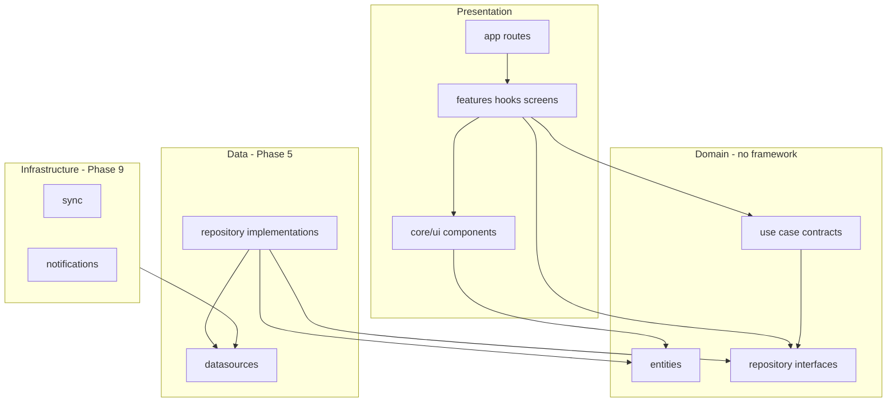

# Phase 2 — Clean Architecture & Folder Structure

**Date:** 2026-05-18  
**Status:** Complete  
**Previous:** [phase-1-audit.md](./phase-1-audit.md)  
**Plan:** [CONVERSION_PLAN.md](./CONVERSION_PLAN.md)

---

## 1. Goals delivered

| Task | Deliverable |
|------|-------------|
| 2.1 | `src/core/*`, `src/features/*`, `src/store/*` scaffold |
| 2.2 | Domain entities in `src/core/domain/entities/` |
| 2.3 | Repository interfaces in `src/core/domain/repositories/` |
| 2.4 | Use-case contracts in `src/core/domain/usecases/` |
| 2.5 | Feature public APIs: `src/features/*/index.ts` |
| 2.6 | Dependency rules + ESLint overrides |
| 2.7 | Expo Router tree (planned — routes in Phase 4) |
| 2.8 | Zustand root slice types in `src/store/types.ts` |

---

## 2. Directory tree

```
src/
├── core/
│   ├── domain/           # ✅ Entities, repo interfaces, use-case contracts
│   ├── data/             # Phase 5 — datasources, models, repo impls
│   ├── ui/               # Phase 7 — shared components + theme
│   └── infrastructure/   # Phase 9 — analytics, sync, notifications, network
├── features/
│   ├── foryou/           # components/, hooks/, screens/, store/
│   ├── bookmarks/
│   ├── interests/
│   ├── search/
│   ├── topic/
│   └── settings/
└── store/                # Global Zustand slices (theme, sync, nav badges)

app/                      # Phase 4 — Expo Router (not created yet)
e2e/flows/                # Phase 10 — Maestro YAML
docs/
```

Each feature folder includes `types.ts` (ViewModel contract) and `index.ts` (public exports only).

---

## 3. Layer dependency rules



| Layer | May import | Must not import |
|-------|------------|-----------------|
| `core/domain` | Other domain modules | `react`, `react-native`, `expo`, `core/data`, `features` |
| `core/data` | `core/domain` | `features`, screens |
| `core/ui` | `core/domain` | Feature internals |
| `features/*` | Own module, `@core/domain`, `@core/ui` | Other features' `hooks/`, `screens/`, `store/` |
| `app/` | `@features/*/index`, `@core/ui` | Feature `hooks/` directly |

---

## 4. Path aliases

| Alias | Path |
|-------|------|
| `@core/*` | `src/core/*` |
| `@features/*` | `src/features/*` |
| `@store/*` | `src/store/*` |

Configured in `tsconfig.json` and `babel.config.js` (`babel-plugin-module-resolver`).

---

## 5. Domain layer summary

### Entities (mirror `core/model`)

| Entity | File |
|--------|------|
| `NewsResource`, `InstantString` | `entities/NewsResource.ts` |
| `UserNewsResource` + mappers | `entities/UserNewsResource.ts` |
| `Topic`, `FollowableTopic` | `entities/Topic.ts`, `FollowableTopic.ts` |
| `UserData` | `entities/UserData.ts` |
| `SearchResult`, `UserSearchResult` | `entities/SearchResult.ts`, `UserSearchResult.ts` |
| `RecentSearchQuery` | `entities/RecentSearchQuery.ts` |
| `ThemeBrand`, `DarkThemeConfig` | enums |
| `normalizeBookmarkNote` | `entities/BookmarkNote.ts` |

### Repository interfaces

| Interface | Android |
|-----------|---------|
| `UserDataRepository` | `UserDataRepository.kt` |
| `NewsRepository` | `NewsRepository.kt` + `Syncable` |
| `TopicsRepository` | `TopicsRepository.kt` |
| `UserNewsResourceRepository` | `CompositeUserNewsResourceRepository.kt` |
| `SearchContentsRepository` | `DefaultSearchContentsRepository.kt` |
| `RecentSearchRepository` | `DefaultRecentSearchRepository.kt` |

Streams use `Observable<T>` (`domain/types/Observable.ts`) instead of Kotlin `Flow`.

### Use-case contracts (implementations in Phase 6)

| Contract | Android |
|----------|---------|
| `GetFollowableTopicsUseCase` | `GetFollowableTopicsUseCase.kt` |
| `GetSearchContentsUseCase` | `GetSearchContentsUseCase.kt` |
| `GetRecentSearchQueriesUseCase` | `GetRecentSearchQueriesUseCase.kt` |
| `GetUserNewsResourcesUseCase` | Composite feed logic (documented in NIA architecture) |

Constants: `SEARCH_QUERY_MIN_LENGTH = 2`, `BOOKMARK_NOTE_MAX_LENGTH = 280`.

---

## 6. Feature ViewModel contracts

Hooks in Phase 8 must satisfy these interfaces (see `src/features/*/types.ts`):

| Feature | Key state |
|---------|-----------|
| For You | `feedState`, onboarding, `deepLinkedNewsId`, `isSyncing` |
| Bookmarks | `selectionMode`, `selectedIds`, `undoPayload` |
| Interests | `selectedTopicId`, list–detail |
| Search | `screenState`, `query`, `recentQueries` |
| Topic | `topic`, `news` list |
| Settings | theme brand, dark mode, dynamic color |

Screens contain **layout + event wiring only** — no repository calls.

---

## 7. Expo Router plan (Phase 4)

| File | Screen |
|------|--------|
| `app/_layout.tsx` | Root: ThemeProvider, QueryClient, splash, offline snackbar |
| `app/(tabs)/_layout.tsx` | Bottom tabs / navigation rail (width ≥ 600) |
| `app/(tabs)/foryou.tsx` | For You |
| `app/(tabs)/bookmarks.tsx` | Saved |
| `app/(tabs)/interests.tsx` | Interests (+ two-pane ≥ 840) |
| `app/search.tsx` | Search (stack, modal presentation) |
| `app/topic/[id].tsx` | Topic detail |
| `app/settings.tsx` | Settings modal |

**Deep link:** `https://www.nowinandroid.apps.samples.google.com/foryou/:linkedNewsResourceId` → `/(tabs)/foryou?linkedNewsResourceId=`

---

## 8. Zustand composition (Phase 4)

```typescript
// Planned: src/store/index.ts
create<RootStoreState>()((...a) => ({
  ...createThemeSlice(...a),      // MMKV-backed
  ...createSyncSlice(...a),       // background fetch
  ...createNavigationSlice(...a), // unread tab dots
}));
```

| Feature-local store | Slice fields |
|---------------------|--------------|
| `features/bookmarks/store/` | `selectionMode`, `selectedIds`, `undo` |
| `features/search/store/` | `query` (survives tab nav; MMKV for process death) |

---

## 9. ESLint boundary enforcement

` .eslintrc.js` overrides:

- `src/core/domain/**` — blocks imports from data, features, React, Expo
- `src/features/**` — blocks deep imports from other features' internal folders

---

## 10. Phase 2 done criteria

- [x] Folder scaffold with README boundary docs  
- [x] All domain entities and repository interfaces  
- [x] Use-case contracts + `normalizeBookmarkNote` implementation  
- [x] Feature `index.ts` public APIs + ViewModel types  
- [x] Zustand root slice types documented  
- [x] Expo Router tree documented  
- [x] ESLint + TS path aliases  

**Next:** Phase 3 — Jest/RNTL harness + fake repositories.

---

## 11. Related files

- Domain entry: `src/core/domain/index.ts`
- Store types: `src/store/types.ts`
- [CONVERSION_PLAN.md](./CONVERSION_PLAN.md)
